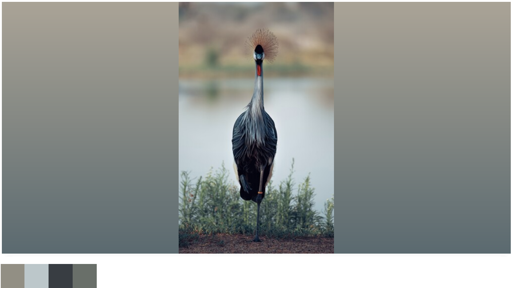

[API Documentation](https://29a.ch/sandbox/2021/dont-crop/docs/modules.html) | [Demo](https://29a.ch/sandbox/2021/dont-crop/) 

[](https://github.com/jwagner/dont-crop/actions/workflows/tests.yml) [](http://www.typescriptlang.org/)

Dont-crop is a [small](#performance), dependency free javascript library to fit a gradient to an image or extract it's primary colors.

It can be used to pad images instead of cropping them, for a very compact [blur up](https://engineering.fb.com/2015/08/06/android/the-technology-behind-preview-photos/) and what ever else you can come up with.


Photo by [Abed Ismail](https://unsplash.com/photos/fZXZ1-hbFrY)

## Installation
```
npm install -S dont-crop
```

## Usage

### ES Modules
```javascript
import {getPalette, fitGradient} from 'dont-crop';

const image = new Image();
// the image needs to be loaded before you can pass it to dont-crop
image.onload = () => {
  console.log(getPalette(image));
  // ['#000000', ...]
  console.log(fitGradient(image));
  // 'linear-gradient(#000000, #ffffff)`
}
image.src = 'example.jpg';
```

### CommonJS

```javascript
const getPalette = require('dont-crop').getPalette;
const fitGradient = require('dont-crop').fitGradient;
// ...
```

### React
See [examples/react/index.tsx](examples/react/index.tsx) for a simple example.

### NodeJS
Usage with node depends on the image processing library being used.
In general an image data object needs to be constructed and passed to
`getPaletteFromImageData` or `fitGradientToImageData`.

The base functions `getPalette` and `fitGradient` will not work using NodeJS.
At least not without bending over backwards.

See `getImageData` in [examples/node-sharp/example.ts](examples/node-sharp/example.ts) for an example using sharp.

## Compatibility

The code should run in all common modern browsers and node from version 12 on.
It has been tested in:
* Chrome
* Firefox
* Safari
* Edge

## Performance

The code is reasonably compact and built with tree shaking in mind.
So your bundles will only include the features you actually use.

When using `fitGradient` only and bundling your code using webpack 5 dont-crop will add about **1.2 kb** to your bundle size.
`getPalette` will cost you a bit more than **1.4 kb**.
You can use both for about **2.1 kb**.

Runtime performance is also fast enough not to worry about.

```
# on a AMD Ryzen 9 5950X
fitGradientToImageData x 43,559 ops/sec ±0.40% (97 runs sampled)
getPaletteFromImageData x 5,420 ops/sec ±0.21% (92 runs sampled)
```

The versions of the functions operating on images rather than the already downscaled image data are slower.
Their performance depends on the exact browser and device in question as well but it should generally be in the ballpark of few milliseconds for reasonably sized images.

## Test Coverage

The code is well covered in tests. The examples are used as end to end tests in both node and a browser (chrome via puppeteer).

## Algorithms

Glad you asked. `fitGradient()` is using simple [linear regression](https://en.wikipedia.org/wiki/Linear_regression).
`getPallete()` is based on [k-means](https://en.wikipedia.org/wiki/K-means_clustering).

## Alternatives

### [Just blur the image](https://developer.mozilla.org/en-US/docs/Web/CSS/filter-function/blur())

using a blurred version of the image as background is a very simple alternative.
I think it looks a bit more busy but it requires less plumbing (just a bit of css) and will generally be faster.

If the gradient fitting is performed on the backend and cached or server side rendered this reverses and it becomes a very efficient approximation of the image.

### [colorthief](https://github.com/lokesh/color-thief)

Provides similar functionality to getPalette.
It weighs in at about 6.4k (version 2.3.2).
It's been widely used since 2019 so it is definitely more battle proofen.
From a quick looks it seems to be using median-cut which will likely yield a bit better results than the simplistic k-means used here.
  
### [smartcrop.js](https://github.com/jwagner/smartcrop.js)

Smartcrop.js is another project of mine. As the name suggests it tries
to find smarter crops.

## Roadmap

There are plenty of interesting ways to improve this library further.

* Adding creative controls over colors (max saturation, max lightness, min lightness)
* Weighting the linear-regression and k-means to focus on the center or edges
* Using a more robust regression variation like Theil-Senn
* Gamma corrected linear gradients by manually interpolating the stops
* Something better than straight k-means for palette extraction

All of these would of course add complexity (and size) as well, so for now it's the simplest thing that could possibly work. 

## License

MIT